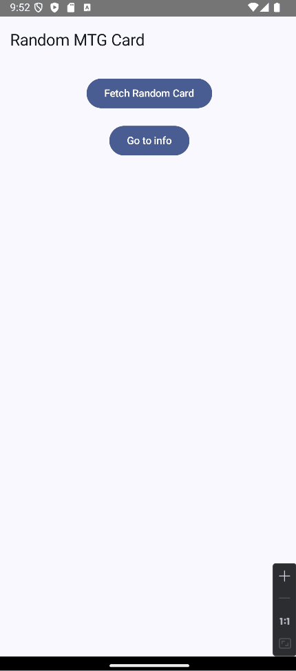

# 🎴 Magic the Gathering -korttisovellus (Kotlin)

Kotlinilla toteutettu sovellus, joka hakee [Scryfall](https://scryfall.com)-sivuston tietokannasta nappia painamalla satunnaisen **Magic the Gathering** -kortin kuvineen ja tietoineen.

## 📱 Sovelluksen esittely

